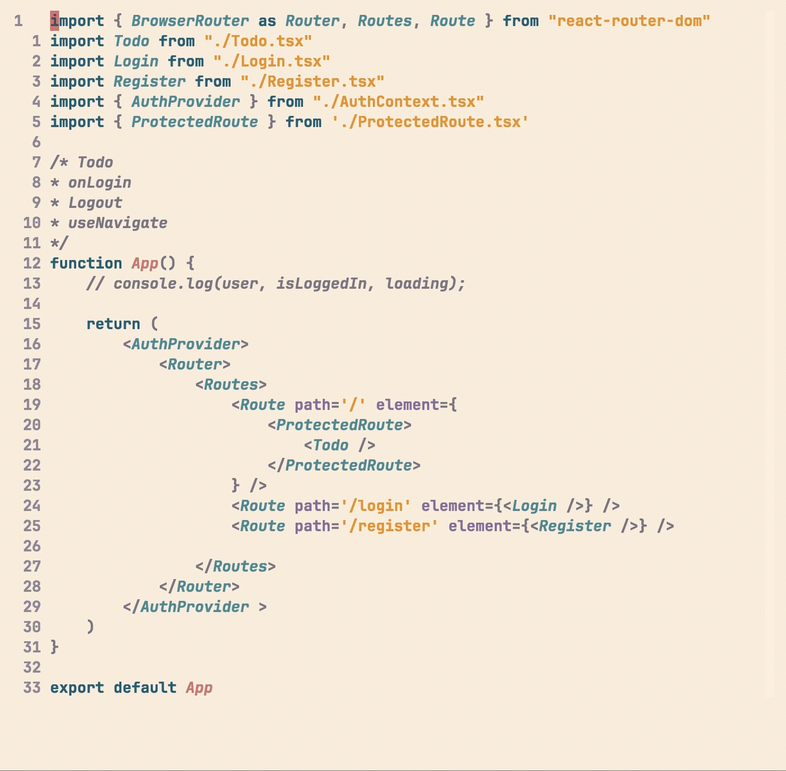

# peep.nvim 👀

> A quick peep at relative col/row numbers

<table>
  <tr>
    <th>Quick Peek</th>
  </tr>
  <tr>
    <td>
      
    </td>
  </tr>
</table>

## Features ✨

- 👁 Peek relative numbers in the same column as the cursor
- 🏷 Main + sub labels for easier orientation
- 🎯 Works in Normal & Visual modes
- ⚡ Optional triggers for d, y, c
- 🟦 Optional Column Peeping
- 👀 Optional Line Preview
- 🎨 Customizable icon and labels

## Installation

### Lazy.nvim

```lua
{
    "lum1nar/peep.nvim",
    opts = {
        colors = {
            label_main = {
                fg = "#A72703",
                bg = "#FCB53B",
            },
            label_sub = {
                fg = "#FCB53B",
                bg = "#44415a",
            },
            line_aux = {
                fg = "#9893a5",
            }
        },
        peep = {
            duration = 700,
            column = false,
            auxline_icon = "·"
        }
    },
    keys = {
        { "<leader><leader>", mode = { "n", "v" }, function() require("peep").peep() end, desc = "Peep" },
    }
}
```
